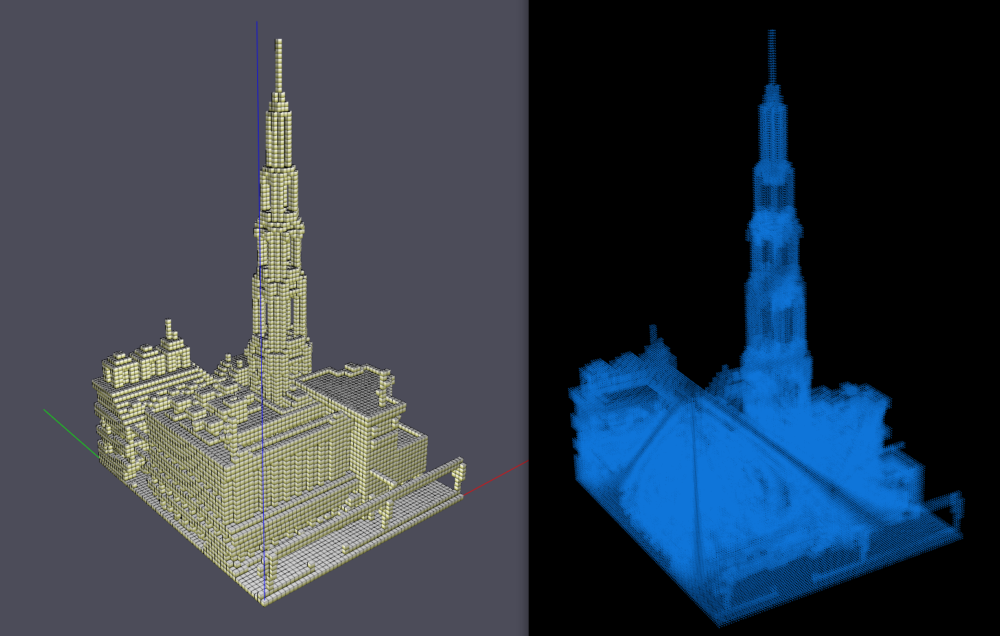
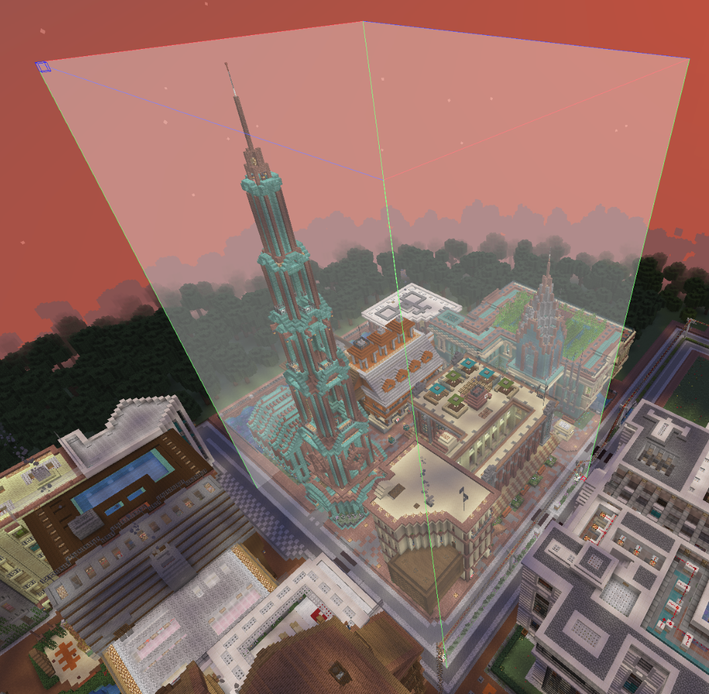

### LiteMatica --> pcd

将Minecraft地图转换为pcd点云文件的小工具。
本仓库属于 Minecraft to gridmap 仓库的第二代。不需要安装额外的mod了，读取方式更改为直接读取较新版本的投影文件( .litematic 后缀 )。

## 使用方式

1. 安装python依赖

```
pip install nbt glumpy json
```
2. 参数配置

编辑 config.json 文件, 字段含义如下

```
{
    "LitematicaFile": "inputs/church.litematic", // 输入文件的目录
    "OutputFile"    : "outputs/point_cloud.pcd", // 输出文件的目录
    "resolution"    : 0.5,                       // 点云分辨率(m)
    "cube_size"     : 1.5                        // 每一个Cube的尺寸(m)
}
```
3. 运行
```
python main.py
```

4. 预览和转换

预览无误后，按空格键进行转换。

5. 注意事项

glumpy 及其依赖有可能在 python 3.11版本无法编译，建议使用3.11以下版本的python

非空气方块一律按Cube处理，不考虑半砖和异形方块。



